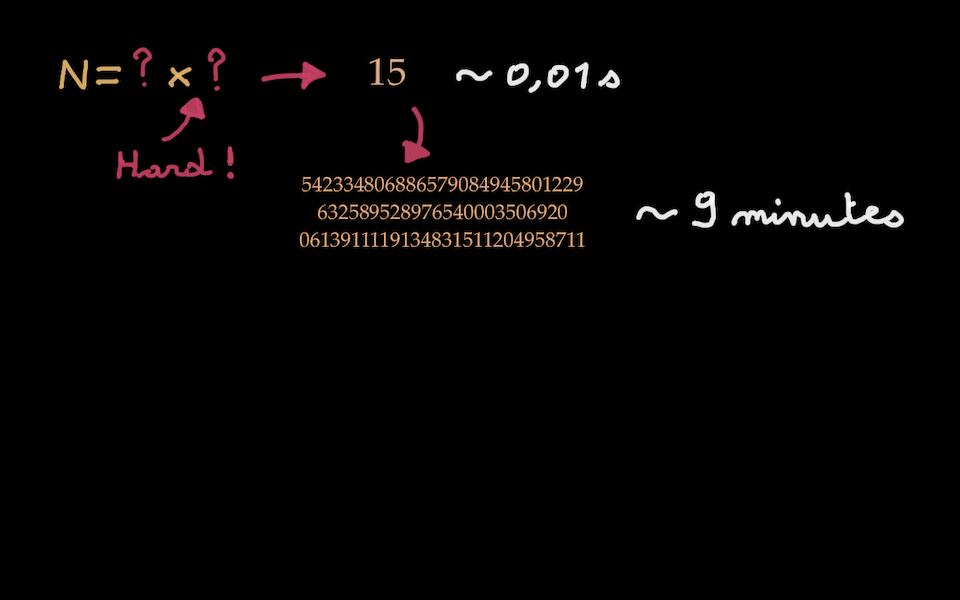
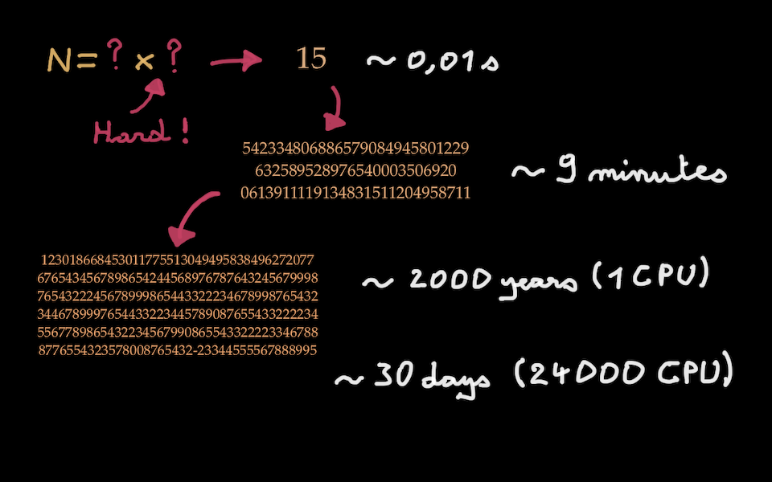
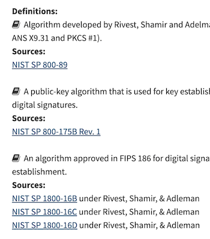
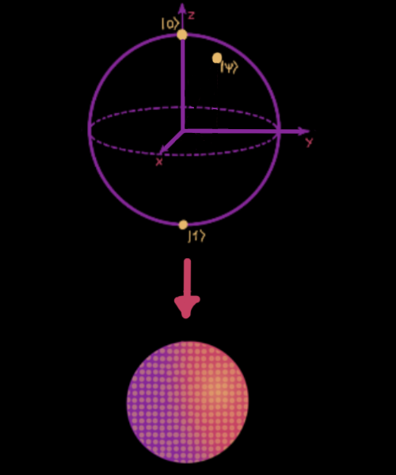
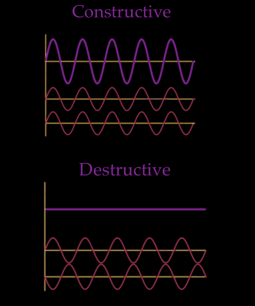
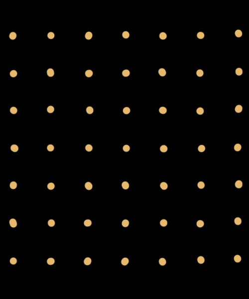
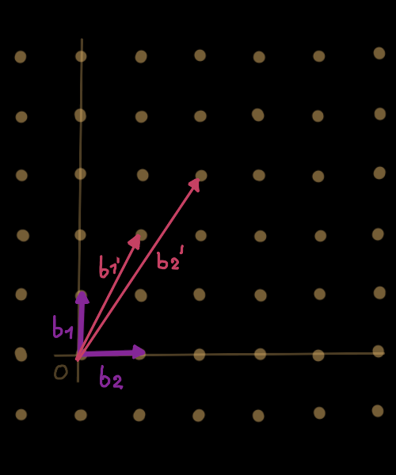
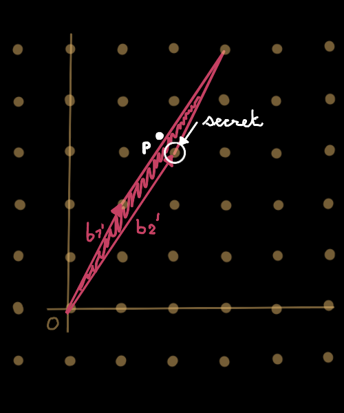
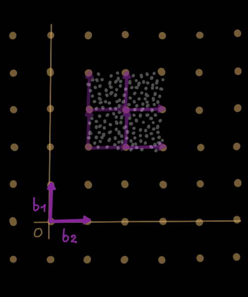

title: Post quantum cryoptography, the future of Internet
class: animation-fade
layout: true

---

class: impact
background-image: url(./images/home.png)

# Post Quantum Cryptography and the future of the Internet

## Willy Malvault - Snowcamp 2023

---
.center[
# At the origin

]

---
# What is a public key cryptography scheme ?
.center[

]

---
# What is a public key cryptography scheme ?
.center[

]

---
# What is a public key cryptography scheme ?
.center[

]

---
# What is a public key cryptography scheme ?
.center[

]

---
# What is a public key cryptography scheme ?
.center[

]

---
#  What's the point ?

.center[]

---
#  What's the point ?

.center[]

---
#  What's the point ?

.center[]

---
# How to implement public key cryptography ?

.col-6[

> Ronald L. Rivest, Adi Shamir, Leonard M. Adleman: A Method for Obtaining Digital Signatures and Public-Key Cryptosystems. Commun. ACM 21(2): 120-126 (1978)
]

--

.col-6[
### RSA cryptosystem
* Provably secure according to .red[**prime numbers factorization**] difficulty

* Provides
    * Public key encryption
    * Digital signature

* Influenced DSA, ECDSA, etc..
]

---
# Prime number factorization


---
# Prime number factorization


---
# Prime number factorization


---
# Prime number factorization


---
# RSA cryptosystem

.col-4[
  KeyGen()
  ```
  n = p * q

  e = ctf(p,q)

  ```

  > e is coprime to Charmichael totient function of n

  ```
  pk = (e, n)

  sk = (mmi(e), n)
  ```

  > mmi is modular multiplicative inverse function
]

--

.col-4[
  Enc(pk, m)

  `\(c = m^{e}\ mod\ n\)`

  Dec(sk, c)

  `\(m = c^{sk}\ mod\ n\)`
]

--

.col-4[
  Sign(sk, m)

  `\(s = hash(m)^{sk}\ mod\ n\)`

  Verify(pk, m)

  `\(h = s^{e}\ mod\ n\)`

  OK if `\(hash(m)=h\)`
]

---
# RSA is working great !

.col-6[
### The RSA problem/challenge
  If an attacker can retrieve `p` and `q` from `n`, then she can retrieve `e` and `sk`

  It takes around 1000 core-years to factorize RSA-768 (record), with a classical computer.

> Fabrice Boudot, Pierrick Gaudry, Aurore Guillevic, Nadia Heninger, Emmanuel Thomé, Paul Zimmermann: Comparing the difficulty of factorization and discrete logarithm: a 240-digit experiment. IACR Cryptol. ePrint Arch. 2020: 697 (2020)
]

--

.col-6[
### NIST standardization


]

---
class: impact, center, middle

# But... this stands only for classical computers

---
class: center

# Quantum computers can break RSA with ease !


<!--  -->

---
class: middle

.col-5[

]

.col-7[
.mid-3[
## Qubit
* Unit of quantum information with:
    * Superposition of basis states `\( | 0 \rangle \)` and `\( | 1 \rangle \)`
    * Entanglement
    * **Cannot be copied**
* And non quantum properties too
    * Can be measured to `1` or `0`
]
]

---

.col-5[

]

.col-7[
.mid-3[
## Superposition
* Qubit state: `\( | \psi \rangle\ =\ \alpha | 0 \rangle \ +\ \beta | 1 \rangle \)`
* `\( \alpha \)` and `\( \beta \)` are the probability amplitude of the qubit to be in the basic states `\( | 0 \rangle \)` or `\( | 1 \rangle \)`
* **The Qubit is said to be in all states at once**
* And... `\( \alpha \)` and `\( \beta \)` can have interferences ...
]
]

---
.col-5[

]

.col-7[
.mid-4[
## Phase interference
* `\( \alpha \)` and `\( \beta \)` can have constructive interference
* `\( \alpha \)` and `\( \beta \)` can have destructive interference
* Interferences can produce a deterministic qubit state
]
]

---

.col-5[

]

.col-7[
.mid-3[
## Measurement
* Once measured, a qubit is in a deterministic state `\( | 0 \rangle \)` or `\( | 1 \rangle \)`
* Measurement disrupts the qubit states
    * Rules are determinating the final state
    * Error correction are needed !

Note: Errors management without copy is hell !
]
]

---

.col-6[

]

.col-6[
.mid-3[
## Entanglement
* Only two qubit can be entangled
    * No sharing
    * No more thant 2 qubits
* Entanglement is preserved according to time and space
* Measuring the state of an entangled qubit allows to determinate the state of the other qubit
* There is neither teleportation nor time travel her !
]
]

---
.col-6[.center[.pad-top-150[
# Why is the qubit so powerfull ?
]]]

--

.col-6[

]

---
# What is quantum supremacy ?

.col-6[
### Nuclear
### Pharma
### Combinatory
]

.col-6[
### Articficial intelligence
### Breaking RSA !
]

---
# Shor algorithm

.col-7[
> Peter W. Shor: Algorithms for Quantum Computation: Discrete Logarithms and Factoring. FOCS 1994: 124-134

.mid-2[

Finds factors of a prime integer in `\(O(\log{}n)\)`
* Factored 15 in 2001
* Factored 21 in 2012
* Failed to factor 35 in 2019
* ~10 000 qubits needed to break 2048 bit RSA
* Last IBM  'Osprey' (09/11/2022) is 433-qubit
]
]

.col-5[

]

---
# Should we be afraid of the monster ?

.col-5[

]

--

.col-7[

]


---
class: center


---
.col-7[
## Quantum Cryptography
Using quantum channels to exchange private keys.

> C. H. Bennett and G. Brassard. "Quantum cryptography: Public key distribution and coin tossing". In Proceedings of IEEE International Conference on Computers, Systems and Signal Processing, volume 175, page 8. New York, 1984
]

--

.col-12[
## Post-quantum Cryptography
Use traditionnal computers to use cryptography schemes robust to quatume attacks.
]

---
class: center

## NIST PQC challenge


---
# Selected protocols
### Public Key encryption and key-establishment
[Kyber](https://pq-crystals.org/): an IND-CCA2-secure key-encapsulation mechanism (KEM)

### Digital signature
[Dilithium](https://pq-crystals.org/): a strongly EUF-CMA-secure digital signature algorithm

[Falcon](https://falcon-sign.info/): Fast-Fourier lattice-based compact signatures over NTRU

[SPHINCS+](https://sphincs.org/): is a stateless hash-based signature scheme.

---
.col-6[
## Introduction to lattice
### Definition

* Infinite set of points in some N dimensional space
]

.col-6[

]

---
.col-6[
## Introduction to lattice
### Definition
* Infinite set of points in some N dimensional space
* Linear combination of vectors from a basis `\({b_1, b_2, ...b_N}\)` of `\(\mathbb{R}^N\)`
* `\( L= \left\{ \sum a_{i} {b} _{i}\ :\ a_{i}\in \mathbb {Z} \right\} \)`
]

.col-6[

]

---
.col-6[
## Introduction to lattice
### Definition
* Infinite set of points in some N dimensional space
* Linear combination of vectors from a basis `\({b_1, b_2, ...b_N}\)` of `\(\mathbb{R}^N\)`
* `\( L= \left\{ \sum a_{i} {b} _{i}\ :\ a_{i}\in \mathbb {Z} \right\} \)`

### Fundamental hard problem
* Closest Vector Problem (CVP)
* Shortest Vector Problem (SVP)
]

.col-6[

]

---
.col-6[
## Lattice based encryption
### Encrypt
* Good basis `\((b_1, b_2)\)` is the private key
* Bad basis `\((b_1', b_2')\)` is the public key
* Encode bit with coordinates of a lattice point (according to public key, by instance)
]

.col-6[

]

---
.col-6[
## Lattice based encryption
### Encrypt
* Good basis `\((b_1, b_2)\)` is the private key
* Bad basis `\((b_1', b_2')\)` is the public key
* Encode bit with coordinates of a lattice point (according to public key, by instance)

### Encrypt
* Try to surround the point
]


.col-6[

]

---
.col-6[
## Lattice based encryption
### Encrypt
* Good basis `\((b_1, b_2)\)` is the private key
* Bad basis `\((b_1', b_2')\)` is the public key
* Encode bit with coordinates of a lattice point (according to public key, by instance)

### Encrypt
* Try to surround the point
* Easy to find with good basis
]


.col-6[

]

---
.col-6[
## Lattice based encryption
### Encrypt
* Good basis `\((b_1, b_2)\)` is the private key
* Bad basis `\((b_1', b_2')\)` is the public key
* Encode bit with coordinates of a lattice point (according to public key, by instance)

### Encrypt
* Try to surround the point
* Easy to find with good basis
* Hard to find with bad basis (or no basis)
]


.col-6[

]

---
.col-6[
## Lattice based digital signature
### Principle
* Encode document with point in space
* Closest Vector is the signature
]


.col-6[

]

---
.col-6[
## Lattice based digital signature
### Principle
* Encode document with point in space
* Closest Vector is the signature

### Disadvantages
* Informations about private key can leak with a great number of signatures.
]


.col-6[

]

---

# From lattice to Kyber
### Learning with errors (LWE)
> Oded Regev. On lattices, learning with errors, random linear codes, and cryptography. pages 84–93, 2005.

## From LWE to Kyber
* Secret and noise can come from the same distribution
* Public Key can be built using a square Matrix
* From (NTRU) : use Ring-LWE, then even Module-LWE (use polynimial rings rather than integers)


---

# Resources
### RSA
[rsa nist standardization](https://csrc.nist.gov/glossary/term/RSA)

### Quantum Computing
* [IBM Composer Guide](https://quantum-computing.ibm.com/composer/docs/iqx/guide/)
* [Blog (IBM) on factorizing 15 with Shor in 2021](https://research.ibm.com/blog/factor-15-shors-algorithm)
* [Are we doomed with Shor ?](https://digitalcommons.csbsju.edu/cgi/viewcontent.cgi?referer=&httpsredir=1&article=1118&context=forum_lectures)

### Post quantum Cryptography
* [Article de Stéphane Bortzmeyer sur l'annonce su NIST](https://www.bortzmeyer.org/nist-pq.html)
* [NIST PQC standardization page](https://csrc.nist.gov/Projects/post-quantum-cryptography/post-quantum-cryptography-standardization)
* [McKinsey - when-and-how-to-prepare-for-post-quantum-cryptography](https://www.mckinsey.com/capabilities/mckinsey-digital/our-insights/when-and-how-to-prepare-for-post-quantum-cryptography)

---

# Resources

## Lattice based encryption explained
* [video on lattice based crypto](https://www.youtube.com/watch?v=832mo7IVJug)
* [Best video on Kyber](https://www.youtube.com/watch?v=FUb75AUXMvw)
* [Learning with Error explanation video](https://www.youtube.com/watch?v=QcVns57MTxg)
* [Dilithium](https://pq-crystals.org/dilithium/index.shtml)
* [Kyber source code](https://github.com/pq-crystals/kyber)
* [Réseaux euclidiens](https://www.youtube.com/watch?v=G23kfRJGH0k)
* [Course on SIS and LWE](https://www.youtube.com/watch?v=K_fNK04yG4o)
* [Course on ring LWE](https://www.youtube.com/watch?v=Lo-_ZBqGa7I)

### Learning with errors (LWE)
> Oded Regev. On lattices, learning with errors, random linear codes, and cryptography. pages 84–93, 2005.

* [LWE and lattices explained](https://www.youtube.com/watch?v=6qD-T1gjtKw)

### IND-CCA2
* [IND-CCA2 secure cryptosystem](https://en.wikipedia.org/wiki/Ciphertext_indistinguishability)
* higher class of "no information on input (text, key) can be retrieved from ciphertext".
* IND-CCA = Indistinguishability under chosen-plaintext attack
* 2 = [Adaptive chosen ciphertext attack](https://en.wikipedia.org/wiki/Adaptive_chosen-ciphertext_attack)

---
# Conclusion
