title: Post quantum cryoptography, the future of Internet
class: animation-fade
layout: true

---

class: impact
background-image: url(./images/home.png)

# Post Quantum Cryptography and the future of the Internet

.center[.author[
## Willy Malvault
### Snowcamp 2023
]]

---
class: center, middle

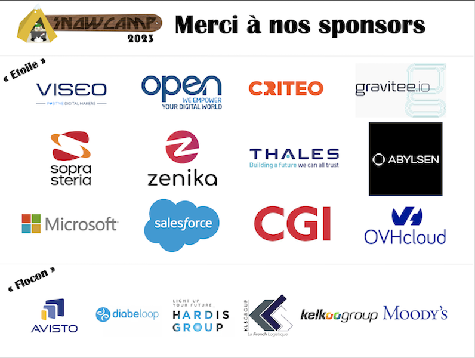

---
.center[
# It all begins with
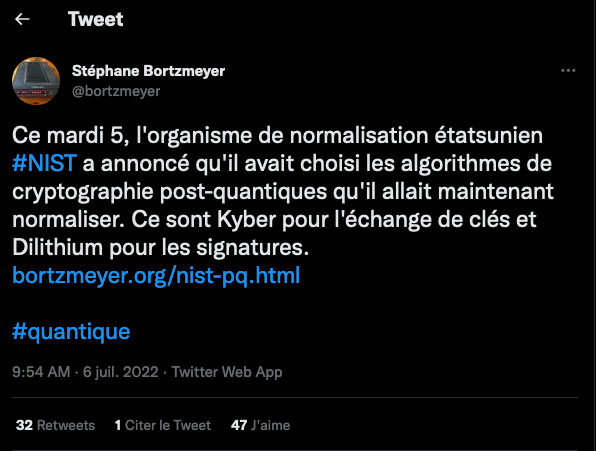
]

---
# My Approach
.col-6[
* Willy Malvault
* Principal Consultant at Sogilis
  * Cloud Native related stuff
  * Cybersecurity
* I started my carreer because of the need to understand how Internet works
* I needed to understand Post Quantum Cryptography
]

--

.col-6[

]

---
# What is a public key cryptography scheme ?
.center[
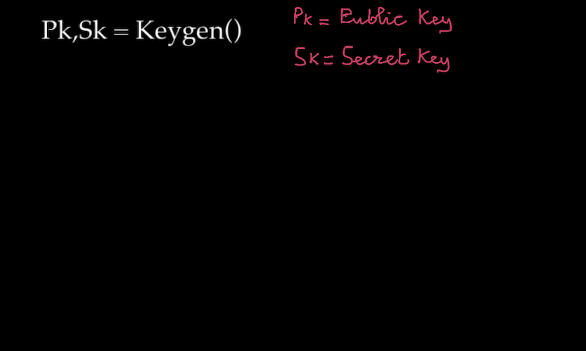
]

---
# What is a public key cryptography scheme ?
.center[
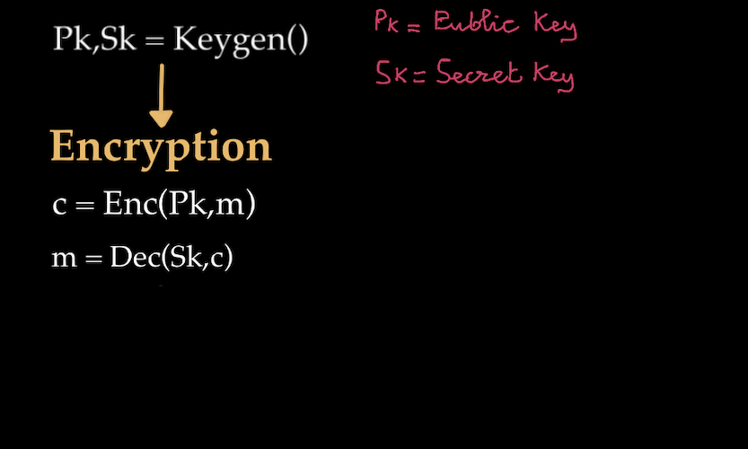
]

---
# What is a public key cryptography scheme ?
.center[
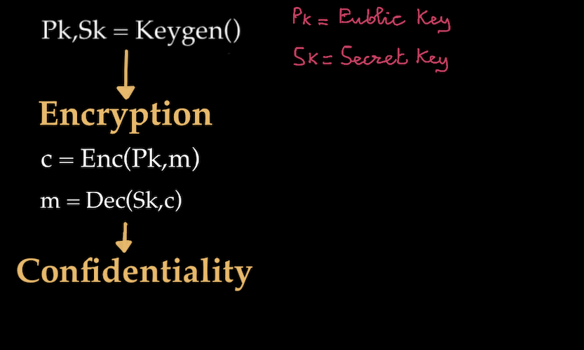
]

---
# What is a public key cryptography scheme ?
.center[

]

---
# What is a public key cryptography scheme ?
.center[
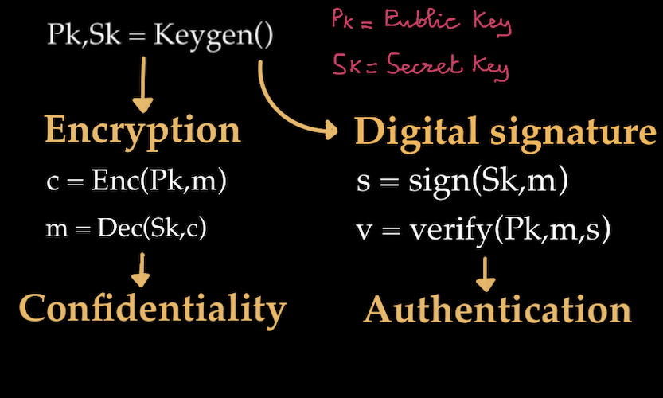
]

---
#  What's the point ?

.center[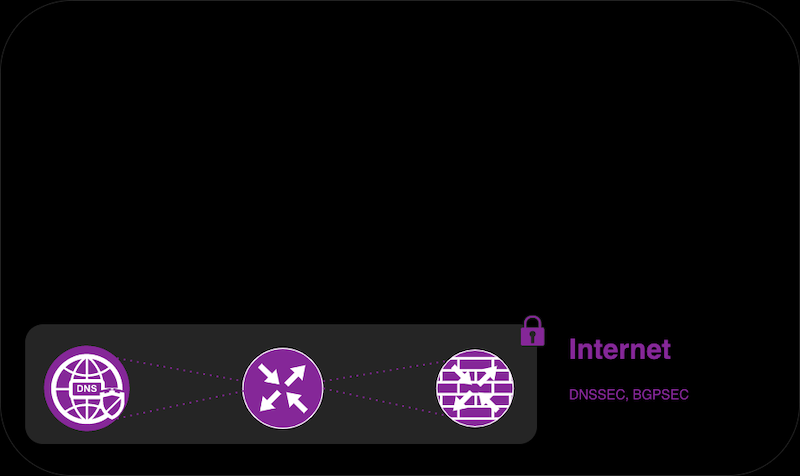]

---
#  What's the point ?

.center[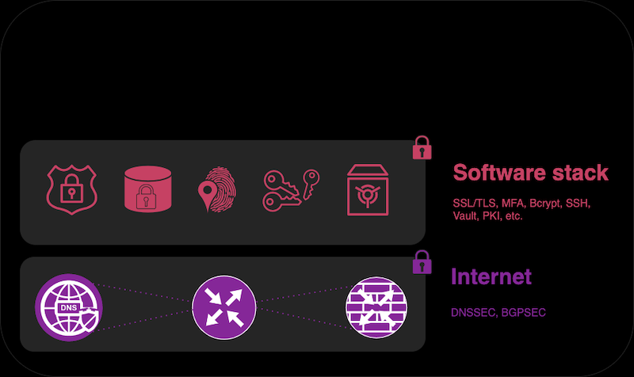]

---
#  What's the point ?

.center[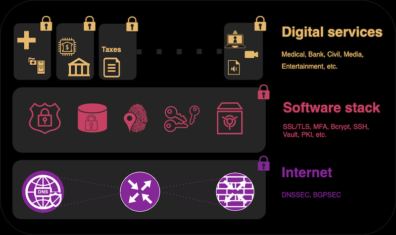]

---
# How to implement public key cryptography ?

.col-6[

> Ronald L. Rivest, Adi Shamir, Leonard M. Adleman: A Method for Obtaining Digital Signatures and Public-Key Cryptosystems. Commun. ACM 21(2): 120-126 (1978)
]

--

.col-6[
### RSA cryptosystem
* Provably secure according to .red[**prime numbers factorization**] difficulty

* Provides
    * Public key encryption
    * Digital signature

* Influenced DSA, ECDSA, etc..
]

---
# Prime number factorization


---
# Prime number factorization


---
# Prime number factorization


---
# Prime number factorization


---
# RSA cryptosystem

.col-4[
  KeyGen()
  ```
  n = p * q

  e = ctf(p,q)

  ```

  > e is coprime to Charmichael totient function of n

  ```
  pk = (e, n)

  sk = (mmi(e), n)
  ```

  > mmi is modular multiplicative inverse function
]

--

.col-4[
  Enc(pk, m)

  `\(c = m^{e}\ mod\ n\)`

  Dec(sk, c)

  `\(m = c^{sk}\ mod\ n\)`
]

--

.col-4[
  Sign(sk, m)

  `\(s = hash(m)^{sk}\ mod\ n\)`

  Verify(pk, m)

  `\(h = s^{e}\ mod\ n\)`

  OK if `\(hash(m)=h\)`
]

---
# RSA is working great !

.col-6[
### The RSA problem/challenge
  If an attacker can retrieve `p` and `q` from `n`, then she can retrieve `e` and `sk`

  It takes around 1000 core-years to factorize RSA-768 (record), with a classical computer.

> Fabrice Boudot, Pierrick Gaudry, Aurore Guillevic, Nadia Heninger, Emmanuel Thomé, Paul Zimmermann: Comparing the difficulty of factorization and discrete logarithm: a 240-digit experiment. IACR Cryptol. ePrint Arch. 2020: 697 (2020)
]

--

.col-6[
### NIST standardization


]

---
class: impact, center, middle

# But... this stands only for classical computers

---
# Quantum computers can break RSA with ease !

.col-6[
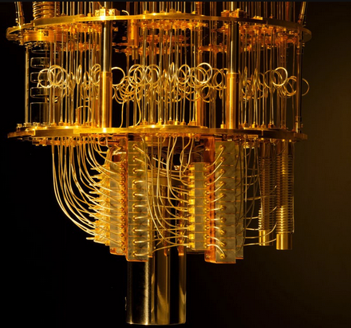
]

--

.col-6[
## Qubit
* Superposition
* Entanglement
* No copy
    * Tricky error management
    * Tricky network maangement

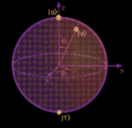
]
---
.col-6[.center[.pad-top-150[
# Why is the qubit so powerfull ?
]]]

--

.col-6[

]

---
# Quantum supremacy

.col-6[
... Is the ability of quantum computing to outperform classical computing.

Typically resolving exponential time problems in polynomial time.
]

.col-6[
### Applies to
* High combinatory
* Pharma, Nuclear, Meteo
* Articficial intelligence
* Breaking RSA !
]

---
# The Famous Shor algorithm

.col-5[
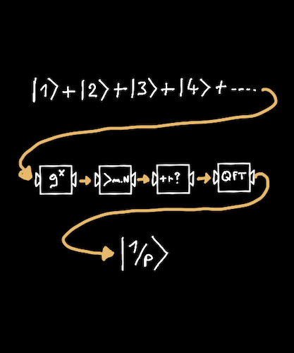
]

--

.col-7[
> Peter W. Shor: Algorithms for Quantum Computation: Discrete Logarithms and Factoring. FOCS 1994: 124-134

.mid-2[

Finds factors of a prime integer in `\(O(\log{}n)\)`
* Factored 15 in 2001
* Factored 21 in 2012
* Failed to factor 35 in 2019
* ~10 000 qubits needed to break 2048 bit RSA
* Last IBM  'Osprey' (09/11/2022) is 433-qubit
]
]


---
# Should we be afraid of the monster ?

.col-5[
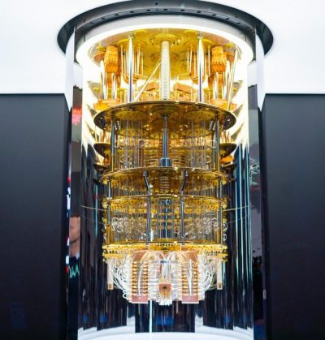
]

--

.col-7[
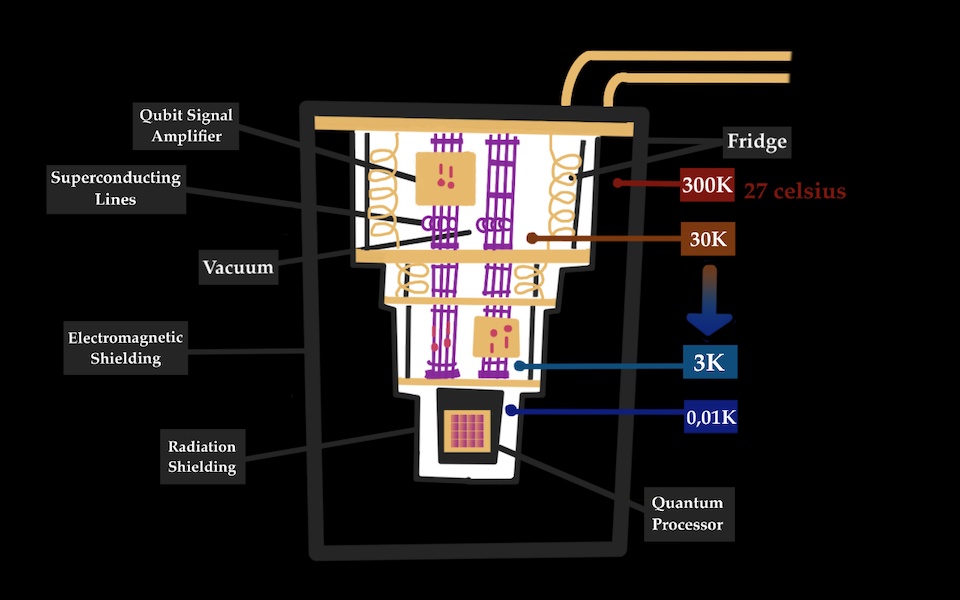
]


---
class: center


---
.col-7[
## Quantum Cryptography
Using quantum channels to exchange private keys.

> C. H. Bennett and G. Brassard. "Quantum cryptography: Public key distribution and coin tossing". In Proceedings of IEEE International Conference on Computers, Systems and Signal Processing, volume 175, page 8. New York, 1984
]

--

.col-12[
## Post-quantum Cryptography
Use traditionnal computers to use cryptography schemes robust to quantum attacks.
]

---
class: center

## NIST PQC challenge


---
# Selected protocols
### Public Key encryption and key-establishment
[Kyber](https://pq-crystals.org/): an IND-CCA2-secure key-encapsulation mechanism (KEM)

### Digital signature
[Dilithium](https://pq-crystals.org/): a strongly EUF-CMA-secure digital signature algorithm

[Falcon](https://falcon-sign.info/): Fast-Fourier lattice-based compact signatures over NTRU

[SPHINCS+](https://sphincs.org/): is a stateless hash-based signature scheme.

---
.col-6[
### Introduction to lattice

* Infinite set of points in some N dimensional space
]

.col-6[

]

---
.col-6[
### Introduction to lattice
* Infinite set of points in some N dimensional space
* Linear combination of vectors from a basis `\({b_1, b_2, ...b_N}\)` of `\(\mathbb{R}^N\)`
* `\( L= \left\{ \sum a_{i} {b} _{i}\ :\ a_{i}\in \mathbb {Z} \right\} \)`
]

.col-6[

]

---
.col-6[
### Introduction to lattice
* Infinite set of points in some N dimensional space
* Linear combination of vectors from a basis `\({b_1, b_2, ...b_N}\)` of `\(\mathbb{R}^N\)`
* `\( L= \left\{ \sum a_{i} {b} _{i}\ :\ a_{i}\in \mathbb {Z} \right\} \)`

### Fundamental hard problem
* Closest Vector Problem (CVP)
* Shortest Vector Problem (SVP)
]

.col-6[

]

---
.col-6[
### Introduction to lattice
* Infinite set of points in some N dimensional space
* Linear combination of vectors from a basis `\({b_1, b_2, ...b_N}\)` of `\(\mathbb{R}^N\)`
* `\( L= \left\{ \sum a_{i} {b} _{i}\ :\ a_{i}\in \mathbb {Z} \right\} \)`

### Fundamental hard problem
* Closest Vector Problem (CVP)
* Shortest Vector Problem (SVP)

### Learning With Error (LWE)
> Oded Regev. On lattices, learning with errors, random linear codes, and cryptography. pages 84–93, 2005.
]

.col-6[

]

---
.col-6[
## Encrypt with Lattice
* Good basis `\((b_1, b_2)\)` is the private key
* Bad basis `\((b_1', b_2')\)` is the public key
* Encode bit with coordinates of a lattice point (according to public key, by instance)
]

.col-6[

]

---
.col-6[
## Encrypt with Lattice
* Good basis `\((b_1, b_2)\)` is the private key
* Bad basis `\((b_1', b_2')\)` is the public key
* Encode bit with coordinates of a lattice point (according to public key, by instance)

## Decrypt with Lattice
* Try to surround the point
]


.col-6[

]

---
.col-6[
## Encrypt with Lattice
* Good basis `\((b_1, b_2)\)` is the private key
* Bad basis `\((b_1', b_2')\)` is the public key
* Encode bit with coordinates of a lattice point (according to public key, by instance)

## Decrypt with Lattice
* Try to surround the point
* Easy to find with good basis
]


.col-6[
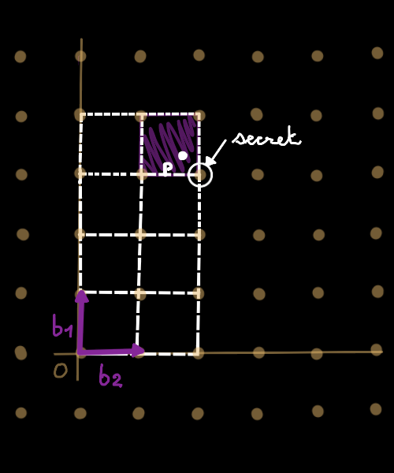
]

---
.col-6[
## Encrypt with Lattice
* Good basis `\((b_1, b_2)\)` is the private key
* Bad basis `\((b_1', b_2')\)` is the public key
* Encode bit with coordinates of a lattice point (according to public key, by instance)

## Decrypt with Lattice
* Try to surround the point
* Easy to find with good basis
* Hard to find with bad basis (or no basis)
]


.col-6[

]

---
.col-6[
## Lattice digital signature
* Encode document with point in space
* Closest Vector is the signature
]


.col-6[

]

---
.col-6[
## Lattice digital signature
* Encode document with point in space
* Closest Vector is the signature

### Disadvantages
* Informations about private key can leak with a great number of signatures.
]


.col-6[

]

---
# From lattice encryption to Kyber

---
# From lattice encryption to Kyber
.col-6[
.mid-3[
* Use polynimial rings rather than integers. Ring-LWE, then even Module-LWE (NTRU)
]
]

.col-6[
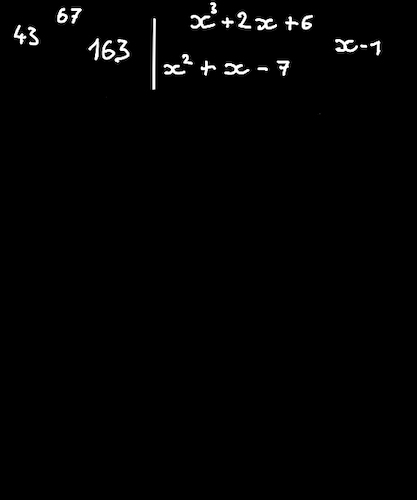
]

---
# From lattice encryption to Kyber
.col-6[
.mid-3[
* Use polynimial rings rather than integers. Ring-LWE, then even Module-LWE (NTRU)
]
]

.col-6[

]

---
# From lattice encryption to Kyber
.col-6[
.mid-3[
* Use polynimial rings rather than integers. Ring-LWE, then even Module-LWE (NTRU)
]
]

.col-6[
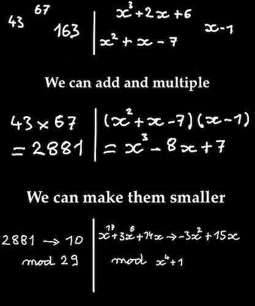
]

---
# From lattice encryption to Kyber
.col-6[
.mid-3[
* Use polynimial rings rather than integers. Ring-LWE, then even Module-LWE (NTRU)
* Public Key can be built using a square Matrix
]
]
.col-6[

]

---
# Kyber matrix

.center[]

---
# From lattice encryption to Kyber
.col-6[
.mid-3[
* Use polynimial rings rather than integers. Ring-LWE, then even Module-LWE (NTRU)
* Public Key can be built using a square Matrix
]
]

.col-6[

]

---
# From lattice encryption to Kyber
.col-6[
.mid-3[
* Use polynimial rings rather than integers. Ring-LWE, then even Module-LWE (NTRU)
* Public Key can be built using a square Matrix
* **Secret and noise can come from the same distribution**
]
]

.col-6[

]

---
# Kyber encryption
.center[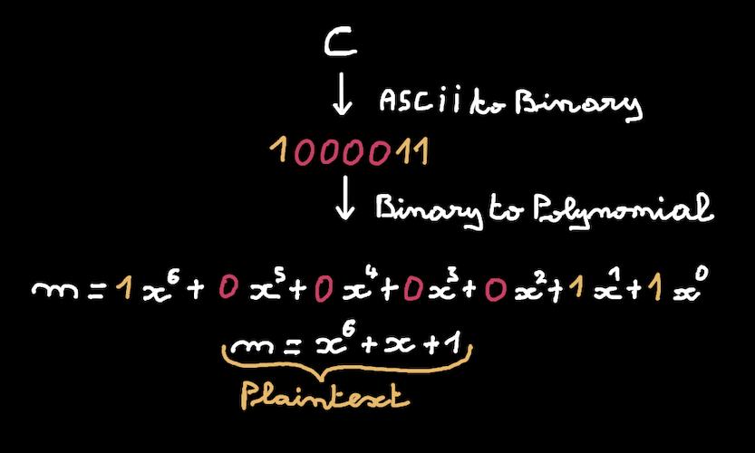]

---
# Kyber encryption
.center[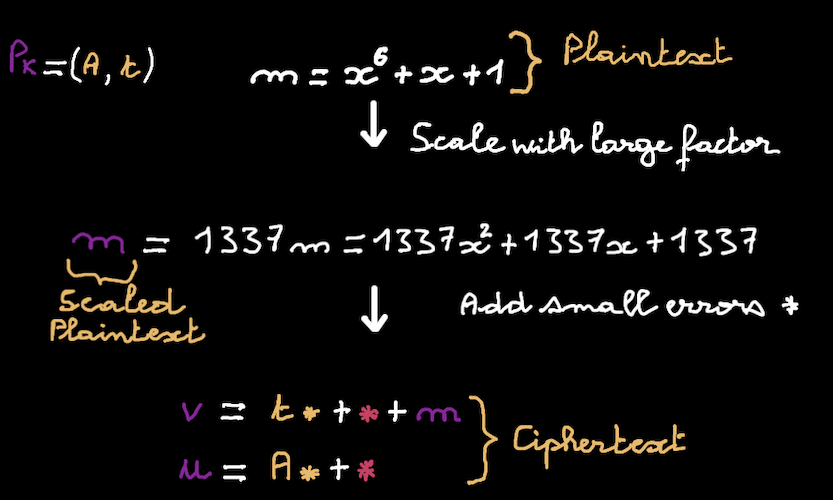]

---
# Kyber decryption
.center[]

---
# Kyber decryption
.center[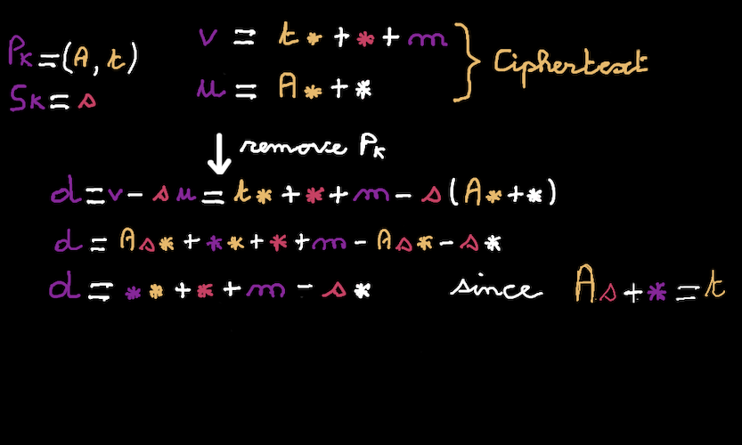]

---
# Kyber decryption
.center[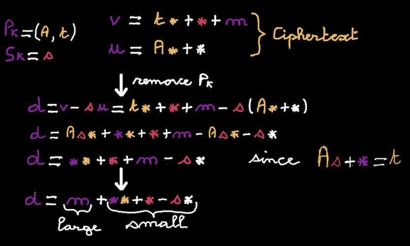]

---
# Kyber decryption
.center[]

---
# Kyber decryption
.center[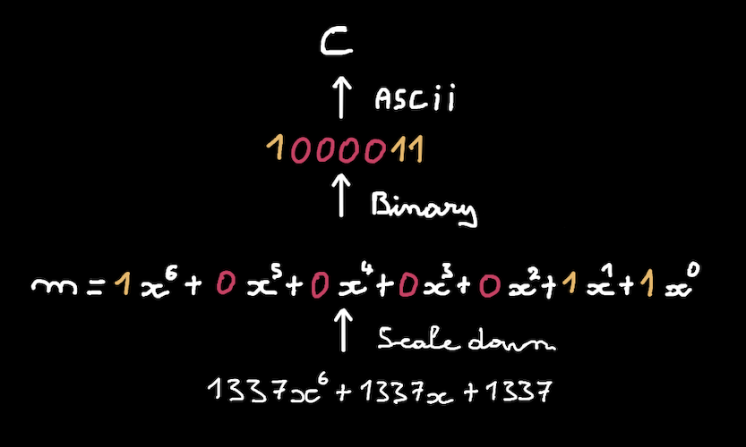]

---
# Kyber performances

--

.center[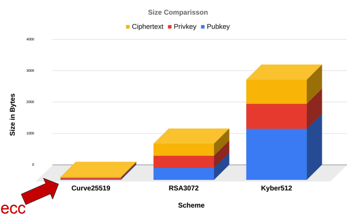]

---
# Kyber performances
.center[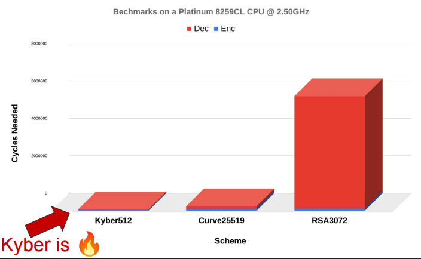]

---
# Kyber performances
.center[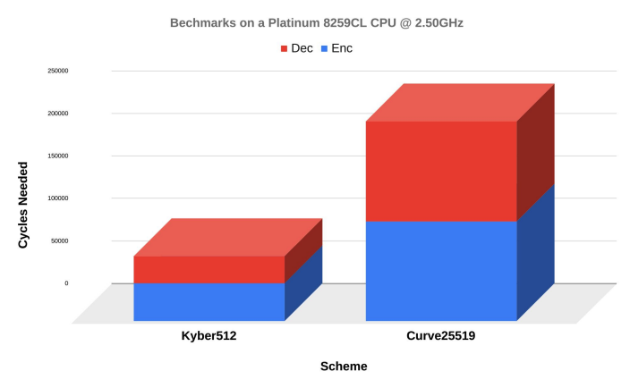]

---
# Conclusion

--

## Quantum computing
* Is a real threat for Cryptography and digital industry
* Is complex
    * Error management
    * Cold environment

--

## Lattice based protocol
* Are secure according to CVP and SVP
* Are just polynomial manipulation
* Provide efficient cryptography schemes
* Are being standardized anyway

---
# Resources
### RSA
[rsa nist standardization](https://csrc.nist.gov/glossary/term/RSA)

### Quantum Computing
* [IBM Composer Guide](https://quantum-computing.ibm.com/composer/docs/iqx/guide/)
* [Blog (IBM) on factorizing 15 with Shor in 2021](https://research.ibm.com/blog/factor-15-shors-algorithm)
* [Are we doomed with Shor ?](https://digitalcommons.csbsju.edu/cgi/viewcontent.cgi?referer=&httpsredir=1&article=1118&context=forum_lectures)

### Post quantum Cryptography
* [Article de Stéphane Bortzmeyer sur l'annonce su NIST](https://www.bortzmeyer.org/nist-pq.html)
* [NIST PQC standardization page](https://csrc.nist.gov/Projects/post-quantum-cryptography/post-quantum-cryptography-standardization)
* [McKinsey - when-and-how-to-prepare-for-post-quantum-cryptography](https://www.mckinsey.com/capabilities/mckinsey-digital/our-insights/when-and-how-to-prepare-for-post-quantum-cryptography)

---
# Resources

## Lattice based encryption explained
* [video on lattice based crypto](https://www.youtube.com/watch?v=832mo7IVJug)
* [Best video on Kyber](https://www.youtube.com/watch?v=FUb75AUXMvw)
* [Learning with Error explanation video](https://www.youtube.com/watch?v=QcVns57MTxg)
* [Dilithium](https://pq-crystals.org/dilithium/index.shtml)
* [Kyber source code](https://github.com/pq-crystals/kyber)
* [Réseaux euclidiens](https://www.youtube.com/watch?v=G23kfRJGH0k)
* [Course on SIS and LWE](https://www.youtube.com/watch?v=K_fNK04yG4o)
* [Course on ring LWE](https://www.youtube.com/watch?v=Lo-_ZBqGa7I)
* [Kyber inspiration video](https://pretalx.c3voc.de/rc3-2021-cwtv/talk/UGZY8B/)

### Learning with errors (LWE)
> Oded Regev. On lattices, learning with errors, random linear codes, and cryptography. pages 84–93, 2005.

* [LWE and lattices explained](https://www.youtube.com/watch?v=6qD-T1gjtKw)

### IND-CCA2
* [IND-CCA2 secure cryptosystem](https://en.wikipedia.org/wiki/Ciphertext_indistinguishability)
* higher class of "no information on input (text, key) can be retrieved from ciphertext".
* IND-CCA = Indistinguishability under chosen-plaintext attack
* 2 = [Adaptive chosen ciphertext attack](https://en.wikipedia.org/wiki/Adaptive_chosen-ciphertext_attack)
