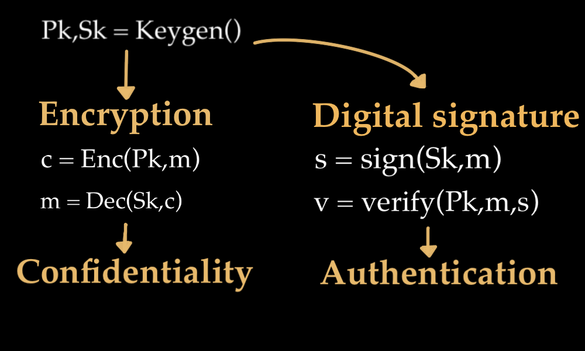
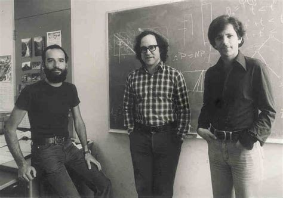
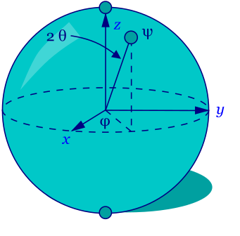

title: Post quantum cryoptography : achievement unlock with Kyber and Dilithium
class: animation-fade
layout: true

---

class: impact
background-image: url(./images/home.png)

# Post Quantum Cryptography, the future of Internet

## Willy Malvault - Snowcamp 2023

---

class: center

# It all starts the 6th of July 2022...


---
## I'm Willy Malvault ....

---
# The crypto zoo


---
# Public key cryptography scheme


<!-- .col-6[ -->
<!-- ``` -->
<!-- pk,sk := KeyGen() -->
<!-- ``` -->

<!-- #### Encryption scheme -->
<!-- ``` -->
<!-- c := Enc(pk, m) -->
<!-- m := Dec(sk, m) -->
<!-- ``` -->
<!-- Confidentiality -->
<!-- ] -->

<!-- .col-6[ -->

<!-- ``` -->
<!-- pk,sk := KeyGen() -->
<!-- ``` -->

<!-- #### Digital signature scheme -->
<!-- ``` -->
<!-- s := Sign(sk, m) -->
<!-- v := Verify(pk, m, v) -->
<!-- ``` -->

<!-- Authentication -->
<!-- ] -->
---

# RSA (legacy) cryptosystem

.col-6[

> Ronald L. Rivest, Adi Shamir, Leonard M. Adleman: A Method for Obtaining Digital Signatures and Public-Key Cryptosystems. Commun. ACM 21(2): 120-126 (1978)
]

.col-6[
* Provably secure according to .red[**prime numbers factorization**] difficulty

* Provides
    * Public key encryption
    * Digital signature

* Have brothers and sisters: DSA, ECDSA, etc..
]

---
### Prime number factorization


---
### Prime number factorization


---
### Prime number factorization


---
### Prime number factorization


---
# RSA cryptosystem

.col-4[
  KeyGen()
  ```
  n = p * q

  e = f1(p,q)

  pk = (e, n)

  sk = (f2(e), n)
  ```
]

--

.col-4[
  Enc(pk, m)

  `\(c = m^{e}\ mod\ n\)`

  Dec(sk, m)

  `\(m = c^{sk}\ mod\ n\)`
]

--

.col-4[
  Sign(sk, m)

  `\(s = hash(m)^{sk}\ mod\ n\)`

  Verify(pk, m)

  `\(h = hash(m)\)`

  `\(h' = s^{e}\ mod\ n\)`

  OK if `\(h=h'\)`
]

---
# Formalized RSA problem
### If an attacker can retrieve `p` and `q` from `n`, then she can retrieve `e` and `sk`

It takes around 1000 core-years to factorize RSA-768 (record), with a classical computer.

> Fabrice Boudot, Pierrick Gaudry, Aurore Guillevic, Nadia Heninger, Emmanuel Thomé, Paul Zimmermann: Comparing the difficulty of factorization and discrete logarithm: a 240-digit experiment. IACR Cryptol. ePrint Arch. 2020: 697 (2020)

--

## But... this stands only for classical computers

---

# Quantum Computer
.col-6[
* 

* lalalala
]

.col-6[
  
  #### IBM Q System One QComputer
]

---
class: center


---

# Factorizing 15
.col-6[
* lalala

* [IBM research blog](https://research.ibm.com/blog/factor-15-shors-algorithm)
]

.col-6[
  
]

---
class: center


> [McKinsey - when-and-how-to-prepare-for-post-quantum-cryptography](https://www.mckinsey.com/capabilities/mckinsey-digital/our-insights/when-and-how-to-prepare-for-post-quantum-cryptography)

---

# Post Quantum Cryptography (PQC)

.col-6[
## Quantum Cryptography
Using quantum channels to exchange private keys.
> Quote BB84
]

.col-6[
## Post-auantum Cryptography
Use traditionnal computers to use cryptography schemes robust to quatume attacks.
]

---

# That is a big problem

## NIST challenge to explain

## Kyber, dilithium, etc...

---

# Lattice based encryption

## Lattice based encryption explained
[video on lattice based crypto](https://www.youtube.com/watch?v=832mo7IVJug)
[Better video on Kyber/Lattices](https://www.youtube.com/watch?v=FUb75AUXMvw)

---

# Kyber in analytics version

[Better video on Kyber/Lattices](https://www.youtube.com/watch?v=FUb75AUXMvw)

---

# Resources

### Post quatum Cryptography
* [Article de Stéphane Bortzmeyer sur l'annonce su NIST](https://www.bortzmeyer.org/nist-pq.html)
* [https://www.nist.gov/cryptography](https://www.nist.gov/cryptography)
---
class: impact, center, middle

# BREAK

---

# Todolist
* how about ECDCA, elliptic curve and PQC ?

---

# Display and Inline Math formulae

1. This is an inline integral: `\(\int_a^bf(x)dx\)`
2. More `\(x={a \over b}\)` formulae.

Display formula:

$$e^{i\pi} + 1 = 0$$

---

class: full

# The post quantum problem

--

## Shor algorithm threat

[Shor Algorithm](https://fr.wikipedia.org/wiki/Algorithme_de_Shor)

--

## Post quantum
* [NIST standarization CFP](https://csrc.nist.gov/Projects/post-quantum-cryptography/post-quantum-cryptography-standardization)
* [NIST Announcement](https://www.nist.gov/news-events/news/2022/07/nist-announces-first-four-quantum-resistant-cryptographic-algorithms)

---
# Kyber - resources

## IND-CCA2 secure Key Encapsulation Mechanism (aka KEM)
* indistinguishability under adaptive chosen ciphertext attack
* higher class of "no information on input (text, key) can be retrieved from ciphertext".

## Based on the hardness of solving the learning-with-errors (LWE) problem over module lattices

---
# Kyber - Key generation

```golang
rho, sig := {0, 1}256
A := Sam(Rk, rho)
s,e := 
```

---

class: full, center

# From classic hard to quantum hard

.col-6[
  ## classic hard problems

  * integer factorization
  * discrete logarithm
]

--
.col-6[
  ## Quantum hard problems

  * algebric lattice
  * provably secure against worst-case instance of lattive problems
]

---
# Learning with errors - 1

## From one bit security to IND-CPA secure PKS Theorem

---
# Learning with errors - 2

> Oded Regev. On lattices, learning with errors, random linear codes, and cryptography. pages 84–93, 2005.

The LWE assumption states that it is hard to distinguish
from uniform the distribution (A, As + e), where A is a uniformly-random matrix in Zm×n, s is a uniformly-random
vector in Zq , and e is a vector with random “small” coefficients chosen from some distribution

---
# Dilithium

[Dilithium](https://pq-crystals.org/dilithium/index.shtml)

---

# Resources

* [Stephan Borzmeyer article](https://www.bortzmeyer.org/nist-pq.html)

---

# Kyber - resources - IND-CCA2

## The Key Encapsulation Mechanism problem (aka KEM)
* Generating a symetric private key for a given session, based on asymetric cryptography.

## [Kyber](https://pq-crystals.org/kyber/index.shtml)
* Is an [IND-CCA2 secure](https://en.wikipedia.org/wiki/Ciphertext_indistinguishability) KEM (Key Encapsulation Mechanism) protocol
    * IND-CCA = Indistinguishability under chosen-plaintext attack
    * 2 = [Adaptive chosen ciphertext attack](https://en.wikipedia.org/wiki/Adaptive_chosen-ciphertext_attack)

---
# Kyber - resources - LWE on module lattice

## Learning With Errors (LWE)
The design of Kyber has its roots in the seminal LWE-based encryption scheme of Regev. Since Regev's original work, the practical efficiency of LWE encryption schemes has been improved by observing that the secret in LWE can come from the same distribution as the noise and also noticing that "LWE-like" schemes can be built by using a square (rather than a rectangular) matrix as the public key. Another improvement was applying an idea originally used in the NTRU cryptosystem to define the Ring-LWE and Module-LWE problems that used polynomial rings rather than integers. The CCA-secure KEM Kyber is built on top of a CPA-secure cryptosystem that is based on the hardness of Module-LWE.

## Resources
* [Kyber source code](https://github.com/pq-crystals/kyber)
---

# Resources
* [Réseaux euclidiens](https://www.youtube.com/watch?v=G23kfRJGH0k)
* [Learning with Error explanation video](https://www.youtube.com/watch?v=QcVns57MTxg)
* [LWE and lattices explained](https://www.youtube.com/watch?v=6qD-T1gjtKw)
* [Course on SIS and LWE](https://www.youtube.com/watch?v=K_fNK04yG4o)
* [Course on ring LWE](https://www.youtube.com/watch?v=Lo-_ZBqGa7I)

---

# Remark pure resources

## 12-column grid layout

Use to the included **grid layout** classes to split content easily:
.col-6[
  ### Left column

  - I'm on the left
  - It's neat!
]
.col-6[
  ### Right column

  - I'm on the right
  - I love it!
]

## Learn the tricks

See the [wiki](https://github.com/gnab/remark/wiki) to learn more of what you can do with .alt[Remark.js]
